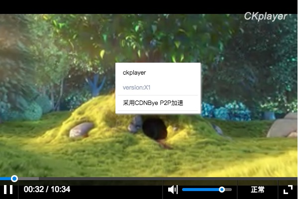

<p align="center">


</p>
<h1 align="center">P2P-CKPlayer</h1>



## 简介
[CKPlayer](http://www.ckplayer.com/),支持http协议下的flv,f4v,mp4,支持rtmp视频流和rtmp视频回放,
支持m3u8格式,是你做视频直播,视频点播的理想播放器。</br>
本项目属于非官方定制版，嵌入了P2P加速引擎CDNBye [hlsjs-p2p-engine](https://github.com/cdnbye/hlsjs-p2p-engine)，
播放hls流支持P2P加速，API与CKPlayer保持一致，使用方法参考[quick-start.html](quick-start.html)。

## 示例
```javascript
<!DOCTYPE html>
<html>
<body>
<div id="video" style="width: 100%; height: 400px;max-width: 600px;"></div>
<script type="text/javascript" src="https://cdn.jsdelivr.net/npm/p2p-ckplayer@latest/ckplayer/ckplayer.min.js" charset="UTF-8"></script>
<script type="text/javascript">
    var videoObject = {
        container: '#video',//“#”代表容器的ID，“.”或“”代表容器的class
        variable: 'player',//该属性必需设置，值等于下面的new chplayer()的对象
        autoplay:true,
        html5m3u8:true,
        video:'https://video-dev.github.io/streams/x36xhzz/url_2/193039199_mp4_h264_aac_ld_7.m3u8',//视频地址
        hlsjsConfig: {   // hlsjs和CDNBye的配置参数
            debug: false,
            // Other hlsjsConfig options provided by hls.js
            p2pConfig: {
                logLevel: true,
                live: false, // 如果是直播设为true
                // Other p2pConfig options provided by CDNBye
                // https://github.com/cdnbye/hlsjs-p2p-engine/blob/master/docs/%E4%B8%AD%E6%96%87/API.md
            }
        }
    };
    var player = new ckplayer(videoObject);
</script>
</body>
</html>
```